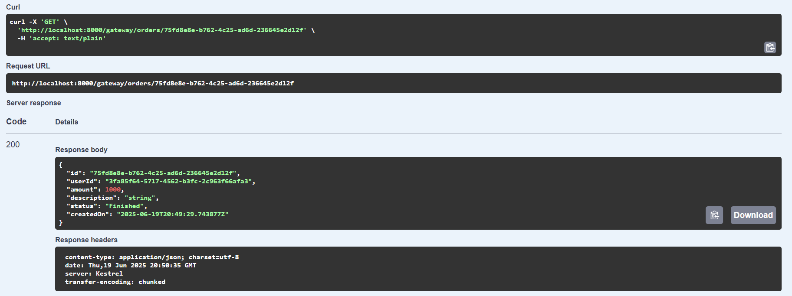

# Асинхронное межсервисное взаимодействие

## 1. Архитектура системы

Система представляет собой микросервисную архитектуру, разработанную для управления заказами и обработкой платежей. Она включает веб-приложение с `API Gatewa`y, сервисы заказов (`OrdersService`) и платежей (`PaymentsService`), а также общий модуль для событий (`Common`). Система обеспечивает создание заказов, их оплату, обновление статусов и асинхронную обработку через очередь сообщений.

### API Gateway

-   **Назначение**: Единая точка входа для маршрутизации запросов к микросервисам OrdersService и PaymentsService.
-   **Технологии**: `ASP.NET Core`, `Ocelot` (для маршрутизации), `Swagger` (для документации).
-   **Функции**: Перенаправление запросов по шаблонам URL, агрегация Swagger-документаций, поддержка CORS для локального фронтенда.

### OrdersService

-   **Назначение**: Управление заказами, включая создание, получение и обновление статусов.
-   **Технологии**: `ASP.NET Core Web API`, `Entity Framework Core`, `PostgreSQL`, `MassTransit` (для `RabbitMQ`).
-   **Функции**: Создание заказов, получение списка заказов пользователя, обработка событий оплаты через `Outbox` и потребителей.

### PaymentsService

-   **Назначение**: Обработка платежей, управление балансами пользователей.
-   **Технологии**: `ASP.NET Core Web API`, `Entity Framework Core`, `PostgreSQL`, `MassTransit` (для RabbitMQ).
-   **Функции**: Проверка баланса, списание средств, генерация событий оплаты, обработка событий создания заказов.

### Common

-   **Назначение**: Общий модуль для определения событий между сервисами.
-   **Технологии**: C# record структуры.
-   **Функции**: Определение событий OrderCreatedEvent и PaymentResultEvent.

### Frontend

## 2. Схема взаимодействия

### Создание заказа

-   Клиент отправляет POST-запрос на `/gateway/orders` через `API Gateway`.
-   `API Gateway` перенаправляет запрос на `OrdersService`.
-   `OrdersService` создает заказ и сохраняет событие `OrderCreatedEvent` в `Outbox` (`Transactional Outbox`).
-   OutboxMessageProcessor публикует событие в `RabbitMQ`.

_Payments API_

_Создание аккаунта_

_Пополнение баланса_

_Создание заказа_

### Обработка оплаты

-   `OrderCreatedEvent` потребляется OrderPaymentConsumer в `PaymentsServic`e (Transactional Inbox проверяет дубликаты).
-   `PaymentsService` выполняет транзакцию: проверяет баланс, обновляет его, сохраняет PaymentResultEvent в Outbox.
-   `OutboxMessageProcessor` публикует `PaymentResultEvent`.
-   `PaymentResultConsumer` в `OrdersService` обновляет статус заказа.

_Получение заказа_

### Получение заказов

-   Клиент отправляет GET-запрос на `/gateway/orders/{userId}`.
-   `API Gateway` перенаправляет на `OrdersService`.
-   `OrdersService` возвращает список заказов.

_Получение заказов пользователя_

### Получение баланса

-   Клиент отправляет GET-запрос на `/gateway/payments/accounts/{userId}`.
-   API Gateway перенаправляет на `PaymentsService`.
-   `PaymentsService` возвращает баланс.

_Получение баланса пользователя_

## 3. Компоненты системы

### API Gateway

-   **Технологии**: `ASP.NET Core`, `Ocelot`, `Swagger`.
-   **Конфигурация**: ocelot.json для маршрутов, `CORS` для http://localhost:5173.
-   **Особенности**: Агрегация Swagger, UI на /swagger/docs.

### OrdersService

-   **Технологии**: `ASP.NET Core`, `Entity Framework Core`, `PostgreSQL`, `MassTransit`.
-   **Модель данных**: `Orders`, `OutboxMessages`.
-   **Особенности**: Реализован `Transactional Outbox` для надежной публикации событий.

### PaymentsService

-   **Технологии**: `ASP.NET Core`, `Entity Framework Core`, `PostgreSQL`, `MassTransit`.
-   **Модель данных**: `Accounts`, `OutboxMessages`, `InboxMessages`.
-   **Особенности**: Реализованы `Transactional Inbox` и `Outbox`, гарантия exactly once через проверку дубликатов.

### Common

-   **Технологии**: C# record.
-   **Модель данных**: `OrderCreatedEvent`, `PaymentResultEvent`.
-   **Особенности**: Обеспечивает единый формат событий.

## 4. API Спецификация

### Документировано с использованием Swagger.

### URL для Swagger UI:

Frontend: http://localhost:5173

API Gateway: http://localhost:8000/swagger/docs

OrdersService: http://orders-service:8080/swagger/v1/swagger.json

PaymentsService: http://payments-service:8080/swagger/v1/swagger.json

## 5. Развёртывание

-   Технологии: Docker, Docker Compose.
-   В `docker-compose.yml` настроены сервисы:
    -   `Frontend` — веб-интерфейс (порт 5173), зависит от API Gateway.
    -   `API Gateway` (порт 8000) — проксирует запросы к микросервисам.
    -   `PaymentsService` (порт 8001) — обрабатывает платежи, использует PostgreSQL и RabbitMQ.
    -   `OrdersService` (порт 8002) — управляет заказами, также использует PostgreSQL и RabbitMQ.
    -   `PostgreSQL` (порт 5433) — единая база данных для микросервисов.
    -   `RabbitMQ` (порты 5672, 15672) — брокер сообщений.
-   Запуск: `docker-compose up --build`

## 6. Примеры использования

_Стартовая страница_

_Пополнение баланса_

_Создание Заказа_

_Выполненный заказ_

## 7. Тестирование
